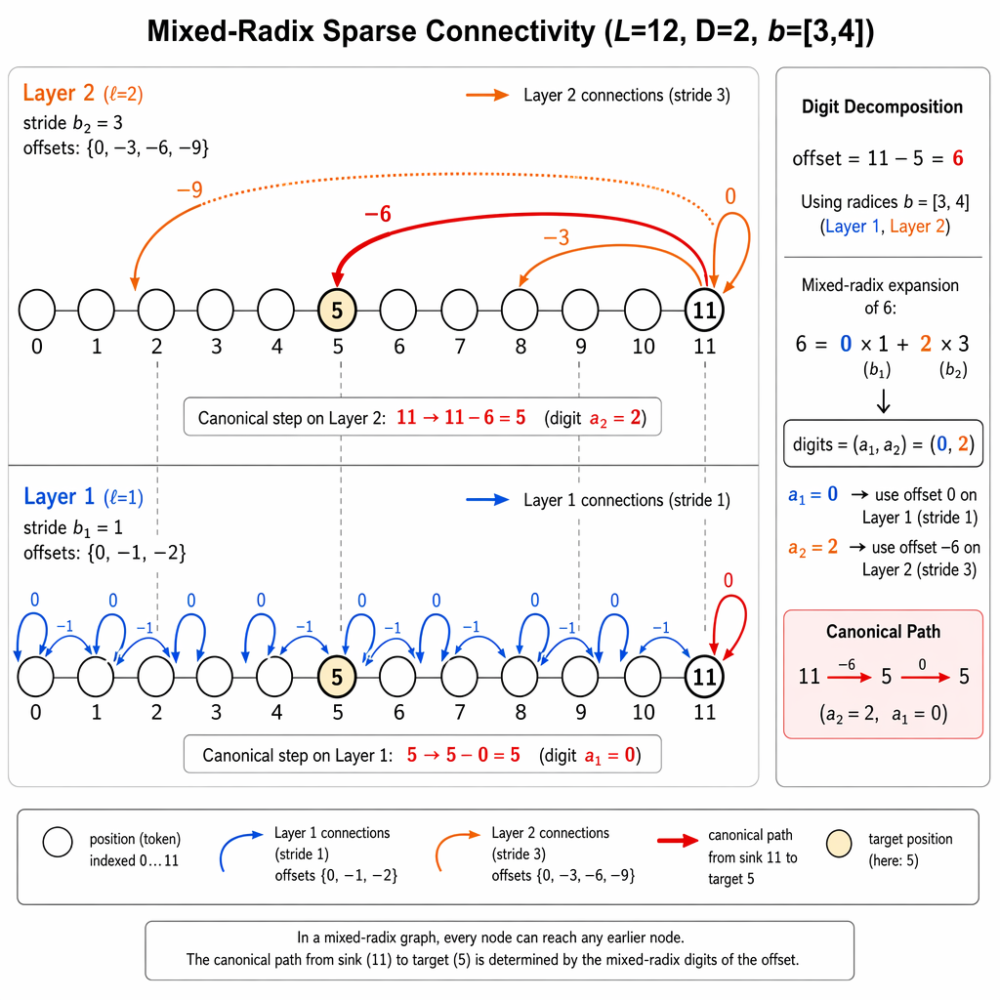
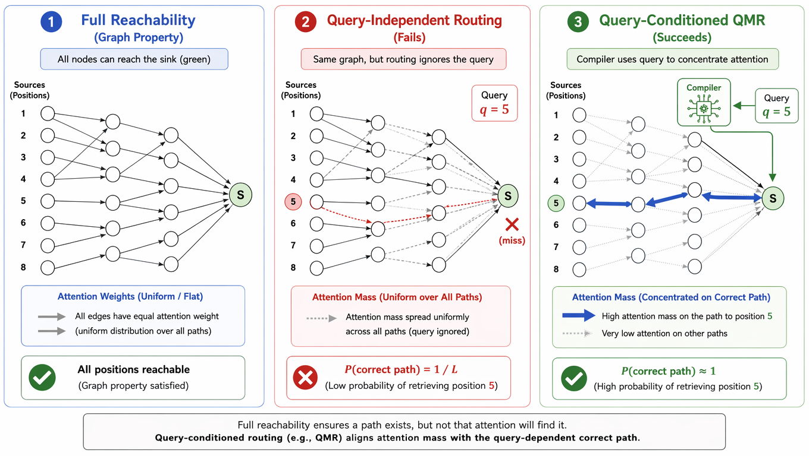
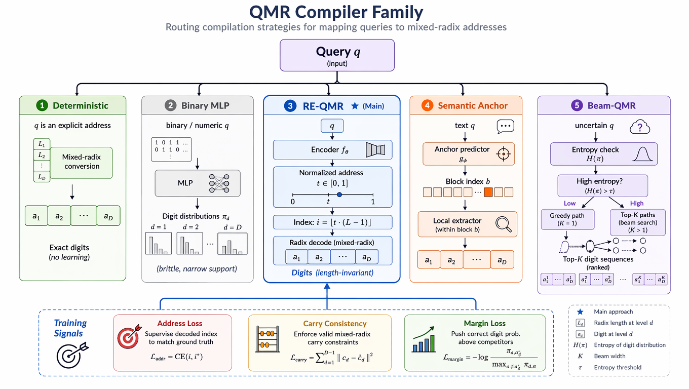

# QMR-Transformer

> **Query-Addressable Mixed-Radix Transformers: Verified Bounds and Efficient Long-Context Retrieval Substrate**
>
> Yuelin Hu<sup>1</sup>, Zhenbo Yu<sup>1</sup>, Zhengxue Cheng<sup>1</sup>, Wei Liu<sup>2</sup>, Li Song<sup>1</sup>
>
> <sup>1</sup>Shanghai Jiao Tong University &nbsp;&nbsp; <sup>2</sup>Shanghai Maritime University

[](https://aaai.org)
[](https://leanprover-community.github.io/)
[](LICENSE)

---

## Overview

We introduce **QMR-Transformers**, an architecture family for query-addressable sparse attention that achieves provably optimal edge-depth trade-offs for fixed-sink retrieval over long contexts. Our contributions include:

- An **edge-depth lower bound** proving that full fixed-sink coverage requires at least $DL^{1+1/D}$ sparse edges, with mixed-radix masks attaining this frontier.
- A **reachability-routability separation theorem** showing that graph coverage alone is insufficient without query-conditioned routing.
- A **compiler-conditioned routing framework** with five compilation strategies (deterministic, Binary MLP, RE-QMR, semantic anchor, beam).
- **Lean 4 formal verification** of all finite combinatorial and algebraic claims via the Lean 4 kernel.
- An **index-free Triton sparse kernel** efficient under ragged prefill and heterogeneous decode.

---

## Architecture

<p align="center">
  
</p>
<p align="center"><b>Figure 1.</b> QMR-Transformer architecture overview. Each layer combines mixed-radix routing heads (attending over structured offset sets) with local content heads (sliding window). The RE-QMR compiler maps the query token to per-layer digit distributions that bias routing logits toward the canonical mixed-radix path connecting the sink to the addressed source position.</p>

---

## Mixed-Radix Graph Construction

<p align="center">
  
</p>
<p align="center"><b>Figure 2.</b> Mixed-radix sparse connectivity for <i>L</i>=12, <i>D</i>=2, <b>b</b>=[3,4]. The two-layer composition covers every backward displacement in [0, <i>L</i>). The canonical path from sink to target has a unique mixed-radix digit decomposition (Theorem 3).</p>

---

## Reachability-Routability Separation

<p align="center">
  
</p>
<p align="center"><b>Figure 3.</b> Reachability–routability separation (Theorem 4). <b>Left:</b> Full graph reachability is necessary but not sufficient. <b>Center:</b> Query-independent routing yields Acc ≤ 1/2 + 1/(2<i>L</i>). <b>Right:</b> Query-conditioned QMR concentrates mass on the correct canonical path.</p>

---

## Query Compiler Family

<p align="center">
  
</p>
<p align="center"><b>Figure 4.</b> Five compilation strategies sharing the fixed mixed-radix graph: (1) deterministic index conversion, (2) Binary MLP, (3) RE-QMR with length-invariant normalized address, (4) semantic anchor for block-level targets, and (5) Beam-QMR maintaining multiple candidate paths under high compiler entropy.</p>

---

## Theoretical Results

| Theorem | Statement | Status |
|---------|-----------|:------:|
| Edge-Depth Optimality | $E(L) \geq DL^{1+1/D}$; mixed-radix attains frontier | Lean 4 ✓ |
| Mixed-Radix Coverage | Unique canonical path for every displacement | Lean 4 ✓ |
| Reachability-Routability Separation | Query-independent routing ⟹ $\mathrm{Acc} \leq 1/2 + 1/(2L)$ | Lean 4 ✓ |
| Softmax Leakage Bound | $P_{\mathrm{path}} \geq \prod_{\ell=1}^{D}(1+\eta_\ell)^{-1}$ | Lean 4 ✓ |
| Stability Lift | QMR-Lite guarantees extend to Full++ under bounded perturbation | Lean 4 ✓ |

All formal claims are verified by the Lean 4 kernel. [Seed-Prover](https://github.com/ByteDance-Seed/Seed-Prover) is used only for proof drafting.

---

## Repository Structure

```
QMR-Transformer/
├── models/
│   ├── qmr_architectures.py          # Architecture family (Lite → Full++)
│   ├── qmr_transformer_block.py      # QMR block: routing + content heads
│   ├── compilers.py                   # Query compiler family
│   └── mixed_radix_generator.py       # Mixed-radix graph construction
├── kernels/
│   └── index_free_kernel.py           # Triton index-free sparse kernel
├── benchmarks/                        # Synthetic evaluation tasks
├── experiments/
│   ├── compiler_stress_test.py        # Compiler extrapolation tests
│   ├── sparse_baseline_comparison.py  # Same-budget baseline comparisons
│   ├── perturbation_sweep.py          # Adaptive perturbation ablation
│   ├── ragged_batching.py             # Ragged prefill/decode benchmarks
│   └── ...
├── lean_proofs/
│   ├── main_theorems.lean             # Core theorems
│   └── SuccinctBound_mathlib.lean     # Mathlib-dependent formalizations
├── config.yaml                        # Experiment hyperparameters
├── train_full.py                      # Training pipeline
└── requirements.txt
```

---

## Installation

```bash
git clone https://github.com/huyuelin/QMR-Transformer.git
cd QMR-Transformer
pip install -r requirements.txt
```

### Lean 4 Verification

```bash
# Install Lean 4: https://leanprover-community.github.io/get_started.html
lake build
```

---

## Experiments

```bash
# Full training pipeline
python train_full.py --config config.yaml --device cuda

# Compiler stress test (narrow-distribution extrapolation)
python experiments/compiler_stress_test.py

# Same-budget sparse baseline comparison
python experiments/sparse_baseline_comparison.py

# Perturbation sweep (adaptive vs. fixed regularization)
python experiments/perturbation_sweep.py

# Ragged kernel benchmarks
python experiments/ragged_batching.py

# Generate LaTeX tables
python generate_tables.py
```

---

## Citation

```bibtex
@inproceedings{hu2027qmr,
  title={Query-Addressable Mixed-Radix Transformers: Verified Bounds and Efficient Long-Context Retrieval Substrate},
  author={Hu, Yuelin and Yu, Zhenbo and Cheng, Zhengxue and Liu, Wei and Song, Li},
  booktitle={Proceedings of the AAAI Conference on Artificial Intelligence},
  year={2027}
}
```

---

## Acknowledgments

- [Seed-Prover](https://github.com/ByteDance-Seed/Seed-Prover) for automated Lean 4 proof drafting
- [Lean 4](https://leanprover-community.github.io/) and Mathlib for formal verification

## License

MIT License
